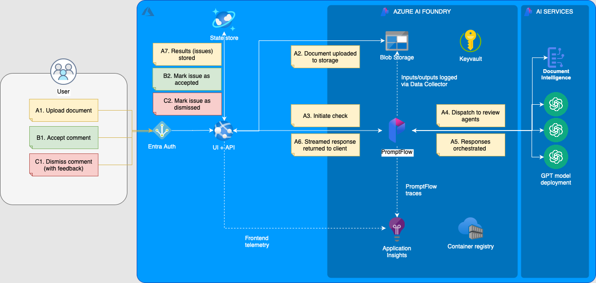

# AI Document Review Agent v2.0

基于 LangChain v1.1 + Azure OpenAI 的通用AI文档智能审核系统。支持 PDF 文档上传、多 Agent 并行审核、实时流式反馈、人工标注与反馈闭环。

## 功能特性

- **多 Agent 并行审核** — 语法检查、表述规范性、合规性等多维度同时审查，通过 PromptFlow 编排
- **PDF 多模态解析** — 结合 OCR（MinerU/PyMuPDF）提取文本与版面信息，支持图文混排文档
- **实时流式反馈** — SSE（Server-Sent Events）流式推送审核结果，前端逐条展示问题
- **高亮批注定位** — 问题定位精确到 PDF 页面坐标（bounding box），前端直接高亮标注
- **Human-in-the-Loop** — 支持接受/驳回审核结果并填写反馈原因，数据存入 Cosmos DB 用于持续优化
- **Azure 企业级架构** — Entra ID 认证、Managed Identity、私有网络、Key Vault 密钥管理
- **IaC 自动化部署** — Terraform 一键部署全部 Azure 资源，Taskfile 管理本地与云端任务

## 技术栈

| 层级 | 技术 |
|------|------|
| **前端** | React 18 + TypeScript + Fluent UI + Vite + react-pdf |
| **后端 API** | Python FastAPI + LangChain v1.1 + SSE |
| **AI 编排** | Azure AI Foundry + PromptFlow |
| **模型** | Azure OpenAI GPT 系列 / DeepSeek（可选） |
| **存储** | Azure Blob Storage（文档）+ Azure Cosmos DB（审核结果与反馈） |
| **认证** | Azure Entra ID + MSAL |
| **基础设施** | Terraform + Azure App Service + Azure Container Registry |
| **PDF 解析** | PyMuPDF + MinerU OCR |

## 项目结构

```
ai-document-review/
├── app/
│   ├── api/                # FastAPI 后端
│   │   ├── config/         # 配置管理
│   │   ├── database/       # Cosmos DB 数据访问层
│   │   ├── routers/        # API 路由 (files, issues, rules)
│   │   ├── security/       # Entra ID 认证
│   │   └── services/       # 核心服务 (审核管线、HITL Agent、MinerU)
│   └── ui/                 # React 前端
│       └── src/
│           ├── components/ # UI 组件 (文档预览、问题详情、规则面板)
│           ├── pages/      # 页面 (文件管理、审核)
│           ├── services/   # API 客户端、注解服务
│           └── types/      # TypeScript 类型定义
├── flows/                  # PromptFlow 工作流定义
│   ├── ai_doc_review/      # 主审核流 (多 Agent 编排)
│   └── ai_doc_review_eval/ # 评估流
├── infra/                  # Terraform 基础设施即代码
├── eval/                   # 评估工具 (指标计算、问题关联)
├── common/                 # 共享模块 (数据模型、日志)
├── docs/                   # 文档与架构图
├── tutorials/              # Jupyter Notebook 教程
├── Taskfile.yml            # 任务自动化
├── install.sh / install.bat
├── start.sh / start.ps1 / start.bat
└── stop.sh / stop.bat
```

## 快速开始

### 前置条件

- [Azure CLI](https://learn.microsoft.com/cli/azure/)
- [Terraform](https://www.terraform.io/) ≥ 1.x
- [Python](https://www.python.org/) ≥ 3.10
- [Node.js](https://nodejs.org/) ≥ 22
- [Task](https://taskfile.dev/)（推荐）或直接使用脚本

### 1. 安装工具链

```bash
# macOS / Linux
chmod +x install.sh && ./install.sh

# Windows
install.bat
```

### 2. 部署 Azure 基础设施

```bash
# 登录 Azure
az login

# 初始化 Terraform
task infra-init

# 编辑环境变量
cp infra/environments/local.tfvars.sample infra/environments/local.tfvars
# 按需修改 local.tfvars 中的配置

# 部署资源
task infra-deploy
```

### 3. 部署应用

```bash
# 构建前后端
task app-build

# 部署到 Azure App Service
task app-deploy

# 部署 PromptFlow 审核流
task flow-deploy
task flow-deploy-endpoint
```

### 4. 本地调试

```bash
# 启动后端 (FastAPI, 端口 8000)
cd app/api
python -m venv .venv && source .venv/bin/activate
pip install -r requirements.txt
# 确保 app/api/.env 已配置
uvicorn app.api.main:app --reload

# 启动前端 (Vite, 端口 5173)
cd app/ui
npm install
npm run dev
```

前端自动将 `/api` 代理到 `localhost:8000`。在 VS Code 中可直接使用 `App (UI & API)` 复合调试配置。

## 使用流程

1. 登录 Web UI（通过 Entra ID 认证）
2. 上传 PDF 文档至 Blob Storage
3. 选择文档并启动审核
4. 系统实时流式返回审核问题（语法、表述、合规等）
5. 点击问题查看详情与 PDF 中的定位高亮
6. 接受或驳回问题，填写反馈原因
7. 反馈数据存入 Cosmos DB，用于评估与模型优化

## 架构



详细架构说明参见 [docs/architecture.md](docs/architecture.md)。

## 评估

`eval/` 目录提供离线评估工具：

- **指标计算** — 精确率、召回率、F1 等
- **问题关联** — 将预测结果与标注真值匹配
- **系统监控** — 运行时的性能与质量监控

详见 [eval/README.md](eval/README.md)。

## 教程

`tutorials/` 目录包含 Jupyter Notebook：

1. **技术架构概览** — AI 文档审核 Agent 系统设计
2. **从零搭建** — 基于 LangChain v1.1 构建文档审核管线
3. **多模态 PDF 解析** — LangChain + OCR 实战
4. **本地部署指南** — 完整部署流程

## License

MIT License — 详见 [LICENSE](LICENSE)。
